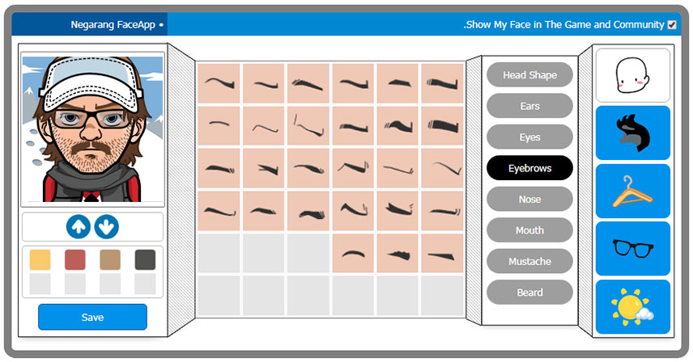

# MangaFace

> Create your own custom avatar.



_Inspired by FaceYourManga_

## Getting Started

### Check Requirements

- Node.js >= 20.19
- PHP >= 8.1
- [Composer](https://getcomposer.org/download/)

### Install

```sh
npm i
```

```sh
composer update
```

```sh
composer build
```

### Build and Run

```sh
npm run build
```

```sh
npm run server
```

### Run for Development

```sh
npm run dev
```

## License
The MangaFace is open-source project licensed under the [MIT license](https://opensource.org/licenses/MIT). For the full copyright and license information, please view the LICENSE file that was distributed with this source code.
