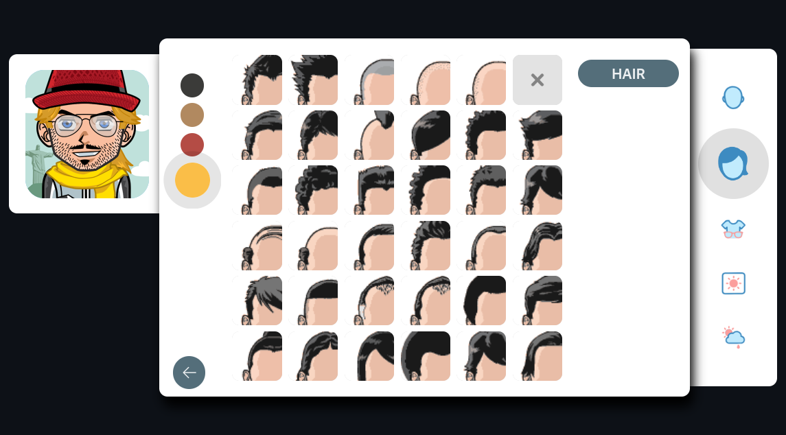

# MangaFace

>  **MangaFace** is a _highly customizable_ avatar generator written in TypeScript. [TRY DEMO](https://mf.miladnia.ir/)

[](https://mf.miladnia.ir/)

_Inspired by FaceYourManga_

## Requirements

- Node.js `>=20.19`

## Installation

```sh
npm i && npm run build
```

```sh
npm run local
```

> [!TIP]
> You can rename the file `.env.production.example` to `.env.production` and set `STATIC_BASE_URL` to the URL your server is running on.

## Development

```sh
npm i && npm run setup
```

```sh
npm run dev
```

## License

MangaFace is an open-source project licensed under the [MIT license](https://opensource.org/licenses/MIT). For the full copyright and license information, please view the [LICENSE](LICENSE) file that was distributed with this source code.
