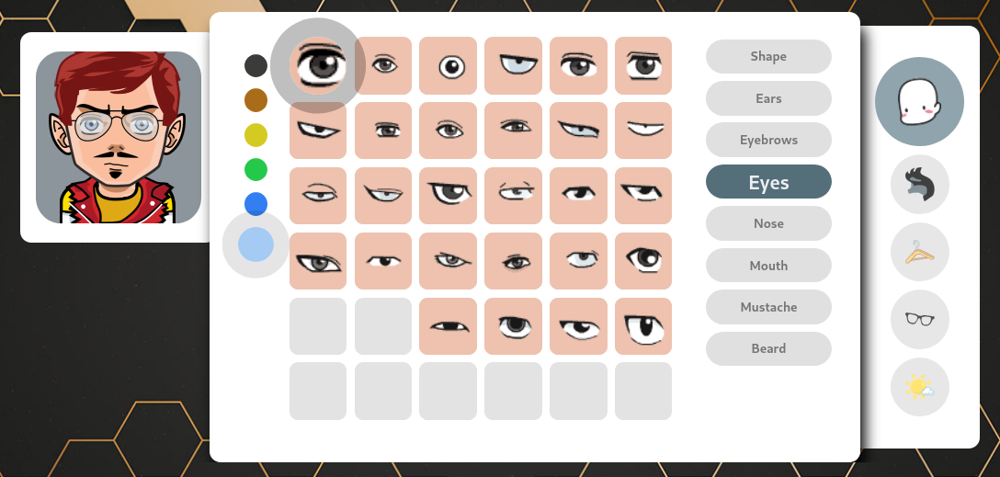

# MangaFace

>  **MangaFace** is a _highly customizable_ avatar generator written in TypeScript.

[](https://miladnia.ir/MangaFace/)

_Inspired by FaceYourManga_

## Getting Started

### Check Requirements

- Node.js `>=20.19`

### Build and Run

```sh
npm i && npm run build
```

```sh
npm run local
```

> [!TIP]
> You can rename the file `.env.production.example` to `.env.production` and set `STATIC_BASE_URL` to the URL your server is running on.

### Run for Development

```sh
npm i && npm run setup
```

```sh
npm run dev
```

## License
The MangaFace is open-source project licensed under the [MIT license](https://opensource.org/licenses/MIT). For the full copyright and license information, please view the LICENSE file that was distributed with this source code.
